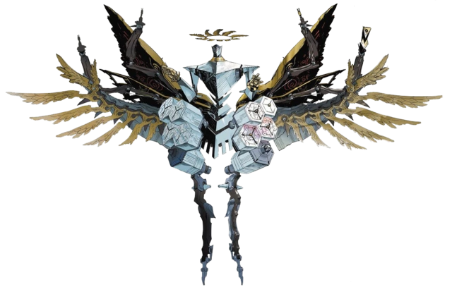

# Persona 5 Review
 

[Persona 5](https://www.amazon.com/Persona-PlayStation-Hits-Standard-4/dp/B01GKHJP98?th=1) was released in April 4, 2017 and it was one of the best procliamed games of the year. It may have lost the Game Of The Year award but it stoled the hearts of new fans. Persona 5 is a one of the memerable games of the decade, and it has the right to be so. From Persona 5's magestic UI, addicting combat, killer sound track, relatable characters, over the top plot. 

# Over the Top Plot

When I said that the plot is plot is over the top it is **over the top**. To boil down the plot of Persona 5 it is some akward teens fighting against the will of the fake **god** **_Yaldabaoth_**.

# The Killer Sound Track

Persona's sound tract 